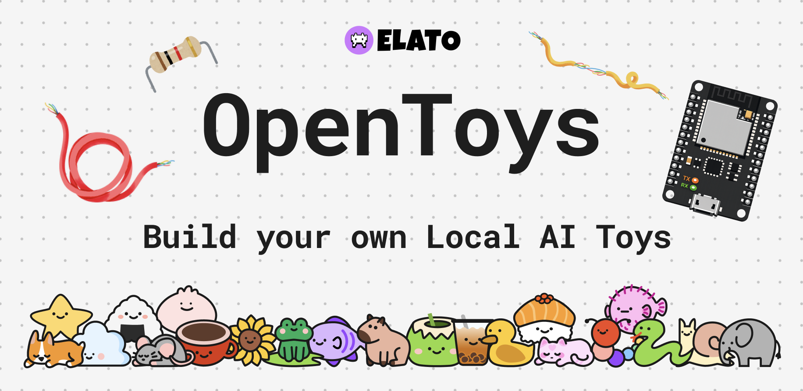
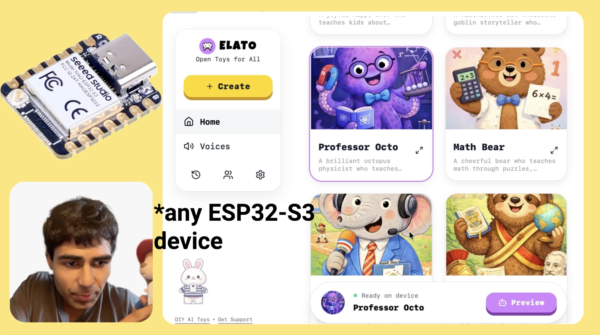

# OpenToys

Local AI version of the ElatoAI project on GitHub.



[](https://youtu.be/YTIHN36Lb7M)

## What is OpenToys?

OpenToys runs fully on-device for Apple Silicon and lets you build AI toys, companions, robots, and other local AI experiences without sending your data to the cloud.

## Core stack

- TTS: Qwen3-TTS and Chatterbox
- LLMs: any model from `mlx-community`
- Platform focus: Apple Silicon
- Privacy model: local-first, works without internet (after setup/model downloads)

## Download

- Direct DMG: [OpenToys_0.1.0_aarch64.dmg](https://github.com/akdeb/open-toys/releases/latest/download/OpenToys_0.1.0_aarch64.dmg)
- All releases: [GitHub Releases](https://github.com/akdeb/open-toys/releases)

## Local development setup

1. Clone the repository with `git clone https://github.com/akdeb/open-toys.git`
2. Install Rust and Tauri with `curl https://sh.rustup.rs -sSf | sh`
3. Install Node from [here](https://nodejs.org/en/download)
4. Run `cd app`
5. Run `npm install`
6. Run `npm run tauri dev`

## Flash to ESP32

1. Connect your ESP32-S3 to your Apple Silicon Mac.
2. In OpenToys, go to `Settings` and click `Flash Firmware`.
3. OpenToys flashes bundled firmware images (`bootloader`, `partitions`, `firmware`) directly.
4. After flashing, the toy opens a WiFi captive portal (`ELATO`) for network setup.
5. Put your Mac and toy on the same WiFi network; the toy reconnects when powered on while OpenToys is running.

## Tested on

1. M1 Pro 2021 Macbook Pro
2. M3 2024 Macbook Air
2. M4 Pro 2024 Macbook Pro

## Project Structure

```
elato/
├── app/
├── arduino/
├── resources/
├────────── python-backend/
├────────── firmware/
└── README.md
```

Python 3.11 runtime is downloaded on first app setup into the app data directory.
